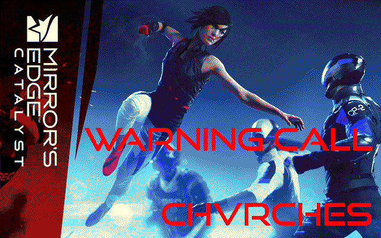
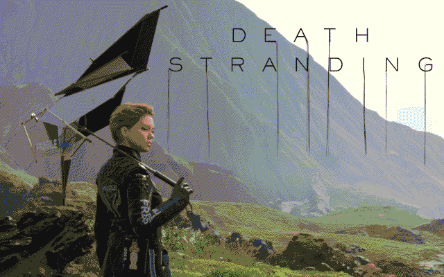

Streaming music demo for the X16
================================

This demo (or actually 2) streams adpcm-encoded sampled music
while also displaying the lyrics. "Karaoke style" if you will.
The adpcm-encoding is not really needed because the SD-card storage is 
enormous, but it's a nice gimmick that reduces the sound data size by a factor of 4,
and showing that the X16 is fast enough to decode a high quality sound stream.
The sound is mono 16 bit at 20 kHz.

A Python script is used to generate the lyric sync timestamps
based off (hand-timed) timestamps in the lyric source file.
You also need the **sox** and **adpcm-xq** tools to generate the sound data files from the original mp3s.

The songs are two songs by Chvrches that they made for the computer games
Mirror's Edge Catalyst and Death Stranding.

